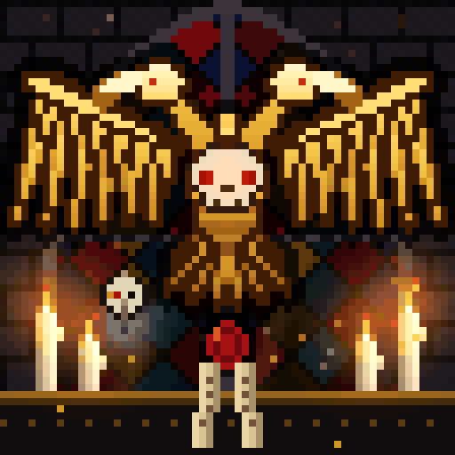

# Lumen Grid: Ave Imperator

A 64×64 LED-matrix animation for the Divoom Pixoo 64, set in the grim darkness of the far future. Every pixel is
generated in code with NumPy and Pillow. The repo has no hand-drawn bitmaps and no imported assets.



## What's in the frame

A gilded **double-headed eagle** hangs in a gothic chapel shrine. The scene is drawn back to front:

- **Stone wall** of offset ashlar blocks.
- **Lancet window**: a pointed arch built from two intersecting circles, with diamond quarry glass in crimson,
  cobalt and amber held by lead cames. A central mullion and a transom divide it. Each pane breathes on its own
  phase.
- **God rays** fall from the window, and dust motes drift down through them.
- **Altar**: a dark marble slab with gold trim.
- **Four candles** with shaded wax and drips. Each flame flickers, and its warm glow lights the wall.
- **Embers** rise and fade as they climb.
- **The eagle**: every feather is painted as a tapered capsule with its own bronze outline, back to front.
  Six primaries per wing fan out, with coverts over their roots and a bright leading edge. The heads have hooked,
  polished beaks and red eyes. A **skull on the breast** has eye sockets that pulse a burning red. A **gold glint**
  sweeps across the metal once per loop.
- **Purity seal**: a red wax disc with a stamped ring. Two inked parchment strips hang from it and bend in an
  unseen draught.
- **Servo-skull**: it hovers in a slow figure-eight. Its bionic eye glows, a brass implant sits on the cranium, a
  blue anti-grav glow shines underneath, and a mechadendrite dangles below.

The animation is a pure function `frame(i, n)`, and every moving part repeats a whole number of times per cycle.
The GIF therefore **loops with no seam**. A test checks that the wrap from the last frame to the first is no
bigger
than an ordinary frame step.

## Run

```bash
pip install -r requirements.txt
python render.py                    # out/aquila_64.gif (native) + out/aquila_256.gif (4x preview)
python render.py --preview-scale 8  # out/aquila_512.gif
python -m pytest -q                 # square, ≤ 5 MB, animated, seamless loop
```

| File | Size | Use |
|---|---|---|
| `out/aquila_64.gif` | 64×64, ~0.4 MB | Native: one pixel per LED. Send this to the panel. |
| `out/aquila_256.gif` | 256×256, ~1.9 MB | Nearest-neighbour preview. |
| `out/aquila_512.gif` | 512×512, ~4.3 MB | Large preview. Square and under the 5 MB limit. |

## Design notes for LED panels

- **Black means the LED is off.** The scene stays dark and lets gold, flame and red eyes carry the light, which is
  how it reads on a physical panel.
- **One global GIF palette** is quantised over all 120 frames. Per-frame palettes make gradients flicker.
- **No dithering.** At 64×64, dither noise reads as sparkle on real LEDs.
- **Outlines everywhere.** Every feather, the skull and the seal get a dark keyline, so the shapes still separate
  at one pixel per LED.

## Layout

```
ledviz/core.py      grid, gradient palettes, GIF export
ledviz/effects.py   the scene: eagle builder, backdrop, animated layers
render.py           CLI renderer
tests/              contest constraints + seamless-loop check
```

## Credits

- Unofficial fan art inspired by the Warhammer 40,000 universe. It is not affiliated with or endorsed by Games
  Workshop. The double-headed eagle is drawn from scratch; no official artwork, logos or assets are used.
- Target hardware: [Divoom Pixoo 64](https://divoom.com/products/pixoo-64).
- [Pillow](https://python-pillow.org/) and [NumPy](https://numpy.org/).
