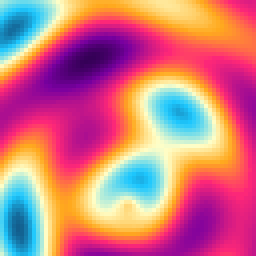
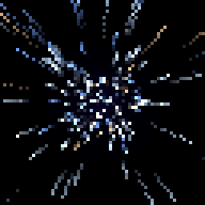

# Lumen Grid

Procedural animations for 64×64 LED matrices like the Divoom Pixoo 64. Every visual is generated in code with
NumPy and Pillow. The repo has no hand-drawn assets.

| Plasma | Warp | Terra |
|:-:|:-:|:-:|
|  |  |  |

- **Plasma**: a demoscene sum of sines run through a cycling sunset-to-cyan palette.
- **Warp**: a hyperspace starfield. 260 stars fly at the viewer and leave light streaks.
- **Terra**: a pixel planet that spins on a tilted axis. It has procedural continents, polar ice, clouds that
  drift at twice the spin speed, a day/night terminator with city lights, and an atmosphere rim.

Every effect is a pure function `frame(i, n)` that is periodic in `n`, so each GIF **loops with no seam**.
A test checks that `frame(n) == frame(0)`.

## Run

```bash
pip install -r requirements.txt
python render.py            # writes out/<name>_64.gif (native) and out/<name>_256.gif (4x preview)
python -m pytest -q         # square, ≤ 5 MB, animated, seamless loop
```

- `out/*_64.gif` is the native panel resolution, one pixel per LED.
- `out/*_256.gif` is a nearest-neighbour upscale that keeps the pixels crisp. Use it for viewing and upload.
  Every file is square (1:1) and under 5 MB.

## Design notes for LED panels

- **Black means the LED is off.** The visuals keep dark backgrounds so the lit pixels stand out on the
  physical panel.
- **One global GIF palette per animation.** Colours are quantised once over all frames, which stops the
  frame-to-frame colour flicker that per-frame palettes cause on gradients.
- **No dithering.** At 64×64, dither noise reads as sparkle on real LEDs, so it is turned off.

## Layout

```
ledviz/core.py      grid coordinates, gradient palettes, GIF export
ledviz/effects.py   plasma, warp, terra (+ EFFECTS registry: frames, fps)
render.py           CLI renderer
tests/              contest constraints + seamless-loop checks
```

## Credits

- Classic plasma and starfield techniques from the demoscene tradition.
- Target hardware: [Divoom Pixoo 64](https://divoom.com/products/pixoo-64).
- [Pillow](https://python-pillow.org/) and [NumPy](https://numpy.org/).
