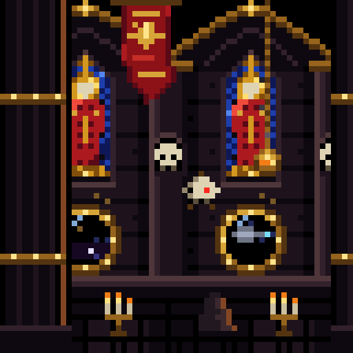
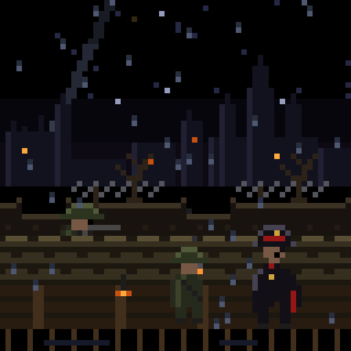
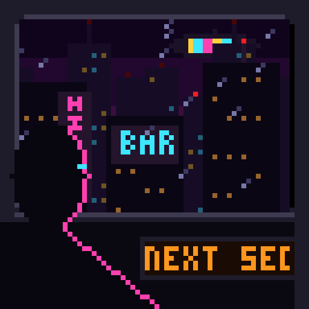

# Lumen Grid: panning pixel dioramas on a 64×64 LED matrix

Small living dioramas for the Divoom Pixoo 64. The camera tracks slowly across a scene built in parallax
layers while small details move: candles flicker, smoke rises, a servo-skull bobs past. Every pixel is
placed in code as a hand-drawn pixel map. The repo has no imported bitmaps. Each GIF loops with no seam.

| Cathedral-ship nave | Trench at night | Maglev, neon city |
|:-:|:-:|:-:|
|  |  |  |

## The scenes

**Cathedral-ship nave**: an endless nave aboard an Imperial starship in the Warhammer 40,000 universe.
- Each bay has a tall stained-glass lancet showing a saint with a gold halo, a red robe and a gold sword.
  A band of light sweeps across the panes (colour cycling).
- Below each lancet is a riveted bronze void-port onto space. Through the ports you see stars, a faint
  nebula and an escort ship. Once per loop the ship fires a lance strike.
- Ribbed vaulting meets in gilt bosses overhead. A skull rests in a niche on each pier.
- On the floor a hooded pilgrim kneels beside a candle stand whose three flames flicker out of step.
- In the foreground a dark fluted pillar slides past at twice the speed of the wall, which gives the
  depth. A red banner ripples, a censer swings on its chain and trails incense, and a servo-skull bobs
  by with a blinking red lens.

**Trench at night**: an Imperial Guard firing line in the rain, from the same universe.
- Far away, a ruined hive city and a cathedral spire burn against the night. Artillery flashes behind them
  twice per loop, and green enemy tracers come out of the ruins.
- An illumination flare drifts down trailing smoke, and a searchlight from our lines sweeps the sky.
- No-man's land slides by in the middle distance: mud, a crater, barbed wire, dead trees.
- In the trench, which moves at twice that speed, a Guardsman leans over the sandbags and fires
  las-bolts. Another smokes a lho-stick, its ember glowing on each drag. A commissar in a peaked cap and
  a red-lined greatcoat watches the line. A lamp flickers on a timber post and rain falls over all of it.

**Maglev, neon city**: a cyberpunk city at night, seen from a train window.
- The carriage is fixed: the window frame, a hooded passenger with a pulsing cyan visor, and a route
  ticker scrolling "NEXT SECTOR 7" in amber.
- Through the glass, the city streams past at three speeds:
  - Far towers with window grids and blinking aviation lights move 1 px per frame.
  - Closer towers move 2 px per frame. One carries a vertical neon sign with a stuttering tube, another
    a cyan BAR sign.
  - The track pylons whip past at 4 px per frame.
- Above, an advertising blimp scrolls colour bars through purple smog. Once per loop a flying car
  overtakes the train.
- Rain on the glass streaks backward with the speed, and the passenger's rim light shifts between pink,
  violet and cyan as the neon goes by.

## Run

```bash
pip install -r requirements.txt
python render.py                 # out/<scene>_64.gif (native, 1 pixel = 1 LED) + out/<scene>_512.gif
python render.py --only nave     # one scene
python -m pytest -q              # Pixoo limits, ≤ 5 MB, square, seamless loop
```

| File | Use |
|---|---|
| `out/*_64.gif` | Native panel resolution. Send this to the Pixoo. |
| `out/*_512.gif` | Nearest-neighbour 8× upscale: crisp pixels, square, under 5 MB. |

## How it's built

- **Pixel maps, not geometry.** Each layer is a grid of characters, one per palette colour, drawn like a
  sprite in a pixel editor. The code only scrolls the layers, cycles the light colours and places the
  moving props.
- **Parallax that loops exactly.** Far layers stay fixed on screen, the way stars at infinity don't move
  when the camera moves. Nearer layers move 1, 2 or 4 px per frame and repeat every 30, 60 or 120 px.
  In 30 frames each layer shifts exactly one tile, and every other motion (flicker, smoke, sway, bob,
  blink, rain) has a period that divides 30. A test
  checks that frame 30 is identical to frame 0. The test was mutation-proven: a pan that stops one pixel
  short makes it fail.
- **Built for the Pixoo.** The device replays only the first 30–32 frames of a GIF, so each scene is
  30 frames at 10 fps. Movement is in whole-pixel steps, because fractional steps shimmer on LEDs. The
  palette stays under 64 colours, there is no dithering, and the scene is mostly black, because black
  means the LED is off. Light comes from small saturated sources.

```
ledviz/core.py          grid size, GIF export, pixel-map stamp
ledviz/scenes/nave.py   cathedral-ship nave
ledviz/scenes/trench.py Imperial Guard trench at night
ledviz/scenes/maglev.py cyberpunk city from a maglev window
ledviz/effects.py       scene registry (frames, fps)
render.py               CLI renderer
tests/                  Pixoo limits + seamless-loop check
```

## Credits

- The nave and the trench are unofficial fan art inspired by the Warhammer 40,000 universe. It is not affiliated with or endorsed by
  Games Workshop. Everything is drawn from scratch; no official artwork, logos or assets are used.
- Target hardware: [Divoom Pixoo 64](https://divoom.com/products/pixoo-64).
- [Pillow](https://python-pillow.org/) and [NumPy](https://numpy.org/).
