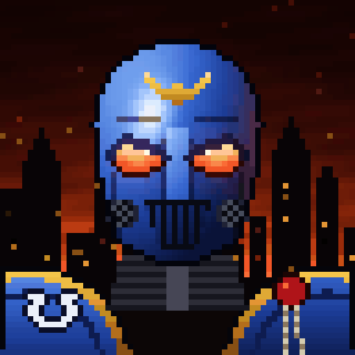
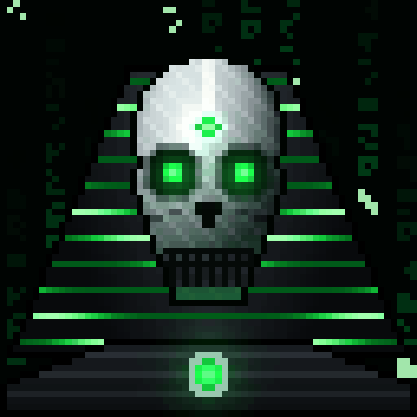
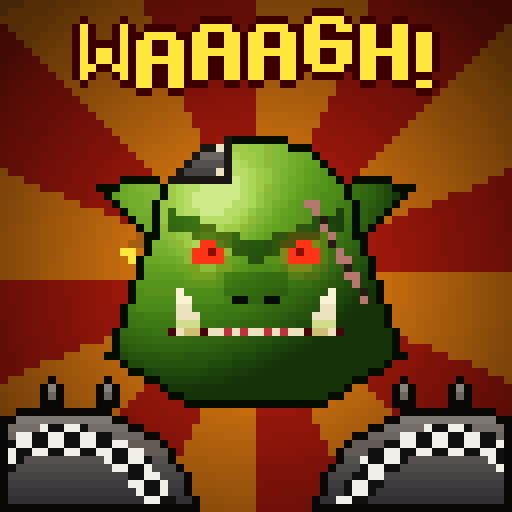

# Lumen Grid: Warhammer 40,000 on a 64×64 LED matrix

Three animated pixel scenes from the 41st millennium, made for the Divoom Pixoo 64. Every pixel is generated in
code with NumPy and Pillow. The repo has no hand-painted bitmaps and no imported assets. Each GIF loops with no
seam.

| Astartes | Necron | WAAAGH! |
|:-:|:-:|:-:|
|  |  |  |

## The scenes

**Astartes**: an Ultramarine in Mk VII power armour stands in front of a burning hive city.
- The ultramarine-blue helmet is shaded as a 3D volume and lit from the top left. Firelight flickers along its
  right edge.
- The angled red eye lenses pulse and bloom.
- The face has a nose ridge, a mouth grille, twin cheek breathers, panel seams and a gold aquila on the brow.
- Below: ribbed gorget cables and gold-rimmed pauldrons. One carries the inverted-omega chapter badge, the other
  a purity seal whose parchment sways.
- Behind: ruined gothic spires with flickering windows, smoke bands drifting across a blood-red sky, artillery
  flashes on the horizon and rising embers.
- A glint sweeps across the helmet once per loop.

**Necron**: an Overlord wakes in his tomb.
- The living-metal skull is brushed silver with a domed cranium and a centre ridge.
- Gauss-green eyes burn in deep sockets. The face has a nasal cavity, cheekbone ridges and a grille of metal
  teeth.
- A phylactery gem glows on the brow.
- A striped nemes headdress has energy pulses running down its channels.
- Ribbed collar plates carry a glowing core that beats.
- Behind: the tomb wall streams with falling glyphs.
- A green energy scan passes down the skull. Twice per loop, the reanimation protocols glitch and tear the
  picture.

**WAAAGH!**: an Ork Boy bellows the war cry.
- His head is lit from above, with a heavy angry brow and beady red eyes. A stitched scar crosses one eye.
- He has a flat nose, pointed ears with a brass ring and a riveted plate bolted to his skull.
- The jaw drops twice per loop to show jagged teeth, a red maw, a tongue and two big tusks. The cheeks stretch
  as it opens, and the head judders while he roars.
- He wears spiked shoulder plates with a Goff black-and-white check.
- Behind: a comic-book burst of rays turns. The **WAAAGH!** title jitters letter by letter and flares on each
  roar.

## Run

```bash
pip install -r requirements.txt
python render.py                 # out/<scene>_64.gif (native, 1 pixel = 1 LED) + out/<scene>_512.gif
python render.py --only necron   # one scene
python -m pytest -q              # square, ≤ 5 MB, animated, seamless loop
```

| File | Use |
|---|---|
| `out/*_64.gif` | Native panel resolution. Send this to the Pixoo. |
| `out/*_512.gif` | Nearest-neighbour 8× upscale: crisp pixels, square, under 5 MB. |

## How it's built

- Each scene is a pure function `frame(i, n)`. Every motion (pulses, particles, rotations, the jaw, glitches)
  repeats a whole number of times per `n` frames, so the last frame flows into the first. A test checks that
  the wrap-around step is no bigger than an ordinary frame step. The test was mutation-proven: a deliberately
  broken loop makes it fail.
- Shapes are built from implicit geometry: ellipses, tapered profiles and lancet arcs. Symmetric pieces are
  tested on the distance from the centre line. Volumes are shaded with a pseudo-normal and a Lambert-plus-
  specular term, then passed through hand-picked colour ramps.
- Small hand-drawn ASCII stamps cover what geometry can't say: the brow aquila, the chapter badge, teeth, tusks
  and the title font.
- **Built for LEDs**: black means the LED is off, every shape gets a dark keyline, each animation has one global
  GIF palette (no frame-to-frame colour flicker) and there is no dithering (it reads as sparkle on real LEDs).

```
ledviz/core.py              grid, drawing kit (ramp, edge, dilate, glow, sprite), GIF export
ledviz/scenes/astartes.py   Space Marine
ledviz/scenes/necron.py     Necron Overlord
ledviz/scenes/ork.py        Ork Boy
ledviz/effects.py           scene registry (frames, fps)
render.py                   CLI renderer
tests/                      contest constraints + seamless-loop check
```

## Credits

- Unofficial fan art inspired by the Warhammer 40,000 universe. It is not affiliated with or endorsed by Games
  Workshop. Every figure is drawn from scratch; no official artwork, logos or assets are used.
- Target hardware: [Divoom Pixoo 64](https://divoom.com/products/pixoo-64).
- [Pillow](https://python-pillow.org/) and [NumPy](https://numpy.org/).
