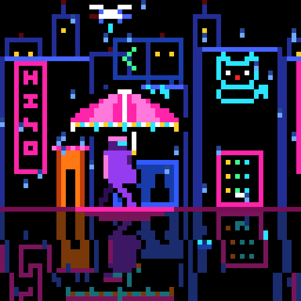
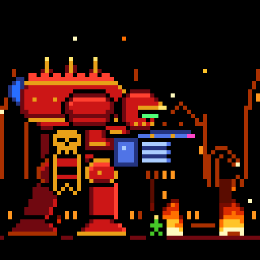

# Lumen Grid: panning pixel dioramas on a 64×64 LED matrix

Three animated dioramas for the Divoom Pixoo 64. Each scene is a 64x64 grid, 30 frames at
10 fps, drawn entirely as hand-placed pixel maps. The repo has no imported bitmaps. Each GIF
loops with no seam.

| Neon Rain | Titan | Robot Coder |
|:-:|:-:|:-:|
|  |  |  |

## The scenes

**Neon Rain**: a walker crosses a wet cyberpunk street under an LED umbrella, while the camera
tracks them down the block.
- The umbrella is the hero shape: pink and magenta panels, a white finial, and a colour-chasing
  hem. A violet-coated walker holds it, lit from above by the umbrella and visored in cyan.
- The sky holds two passes: a holographic koi swims across once, and a police drone with a
  cyan searchlight strobes red and blue on another pass.
- The shopfronts carry a stuttering vertical glyph sign, a rooftop `</>` sign whose tubes light
  up one at a time, a filled ramen bowl with rising steam, and a waving neon cat over a vending
  machine. Towers further back carry blinking aviation lights.
- Rain streaks fall behind the walker, and the wet street mirrors the whole scene in a rippling
  reflection.

**Titan**: a Warlord Titan strides through a burning hive city, camera tracking with it.
- The Titan is a hand-drawn war machine: a spired, crenellated carapace, a low head with a green
  eye slit, a turbo-laser on one arm and a mega-bolter on the other, a gold skull-cog banner, and
  a pulsing plasma reactor on its back. Its ten-frame stride plants and lifts each foot in turn,
  with the whole body sinking slightly on every footfall.
- The turbo-laser fires twice per loop. Each shot ends in a building eruption on the skyline
  behind the Titan. The mega-bolter bursts with muzzle flashes and tracers between the laser
  shots.
- Small troopers flee past the Titan's feet for scale, and embers rise against a burning
  gothic skyline of spires, a cathedral with a rose window, and a broken arch.

**Robot Coder**: a robot pair-programmer types at a monitor, late at night, until the tests
pass.
- The robot types with alternating hands, its visor blinking, while syntax-highlighted code
  scrolls up the monitor and the newest line types itself out behind a blinking cursor.
- At frame 16 it slams the Enter key. The screen freezes into a TEST pane with a progress bar,
  and the robot sweats while the tests run.
- At frame 22 the pane turns into a green PASS with a check mark. The robot cheers, pumps its
  fist, and its antenna cycles through colours while confetti falls.
- On the desk, an RGB keyboard chases the Google colours, a rubber duck hops on the PASS beat,
  and a mug labelled OIL steams. Through the window behind the monitor, a moonlit skyline
  twinkles.

## Run

```bash
pip install -r requirements.txt
python render.py                 # out/<scene>_64.gif (native, 1 pixel = 1 LED) + out/<scene>_512.gif
python render.py --only neon     # one scene
python -m pytest -q              # Pixoo limits, rubric gate, ≤ 5 MB, square, seamless loop
```

| File | Use |
|---|---|
| `out/*_64.gif` | Native panel resolution. Send this to the Pixoo. |
| `out/*_512.gif` | Nearest-neighbour 8× upscale: crisp pixels, square, under 5 MB. |

## How it's built

- **Pixel maps, not geometry.** Each layer is a grid of characters, one per palette colour,
  drawn like a sprite in a pixel editor and stamped onto the frame with `ledviz.core.stamp`.
  The code only scrolls the layers, cycles the light colours, and places the moving props.
  Procedural code is used only for motion, flicker, colour cycling, and simple geometry.
- **Parallax that loops exactly.** Far layers move 1 px per frame on a 30 px tile, nearer
  layers move 2 px per frame on a 60 px tile, and the fastest layers move faster still on a
  tile that is still a multiple of 30. `frame(i)` never wraps `i` (no `i %= n`): every motion is
  periodic in 30 by construction, so `frame(30)` equals `frame(0)` exactly, and the GIF's wrap
  from the last frame back to the first is an ordinary step. `tests/test_effects.py` checks this
  for every scene. The check is mutation-proven: a pan that stops one pixel short, or a drift
  term like `i // 2`, makes it fail.
- **Built for the Pixoo.** The device replays only the first 30 to 32 frames of a GIF, so each
  scene is exactly 30 frames at 10 fps. Movement is in whole-pixel steps, because fractional
  steps shimmer on LEDs. The palette stays at or under 64 unique colours across all frames, with
  no dithering or gradients. The scene is mostly true black (0,0,0), because black means the LED
  is off, so light reads against a dark background instead of competing with it.
- **The rubric gate.** `ledviz/rubric.py` measures each scene against the contest's proxies over
  all 30 frames: how much of the frame is true black, how little is dimly lit, how saturated and
  how vivid the lit pixels are, the peak brightness, and the frame-to-frame motion.
  `tests/test_rubric.py` fails the suite if any registered scene misses any proxy.
- **Contact sheets.** `python preview.py <name>` writes a 6x5 contact sheet of all 30 frames to
  `out/<name>_sheet.png` and prints the rubric metrics table, so a scene can be judged by eye at
  1:1 pixel scale before trusting the numbers alone.

```
ledviz/core.py          grid size, GIF export, pixel-map stamp
ledviz/rubric.py         contest rubric proxies and thresholds
ledviz/scenes/neon.py    Neon Rain
ledviz/scenes/titan.py   Titan
ledviz/scenes/coder.py   Robot Coder
ledviz/effects.py        scene registry (frames, fps)
render.py                CLI renderer
preview.py               contact-sheet + metrics tool
tests/                   Pixoo limits, rubric gate, seamless-loop check
```

## Credits

- The Titan is unofficial Warhammer 40,000 fan art. It is not affiliated with or endorsed by
  Games Workshop. Everything is drawn from scratch; no official artwork, logos or assets are
  used.
- Target hardware: [Divoom Pixoo 64](https://divoom.com/products/pixoo-64).
- [Pillow](https://python-pillow.org/) and [NumPy](https://numpy.org/).
